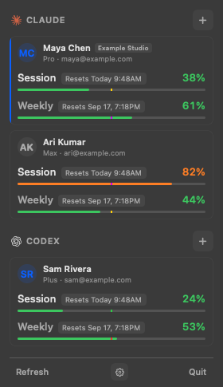
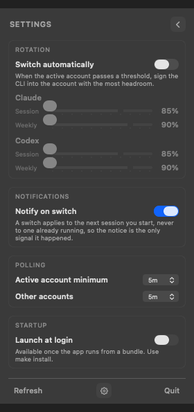

# Claudex

Claudex is a macOS menu bar app that tracks Claude and Codex subscription
accounts and routes each CLI request through the selected account.

It shows 5-hour and weekly usage, keeps credentials in macOS Keychain, and can
switch accounts before a limit interrupts your work.

<p align="center">
  
  
</p>

## Install

Requires Apple silicon and macOS 14 Sonoma or newer.

### Homebrew

Recommended. Two commands on first install:

Homebrew 7 asks you to trust third-party casks first. Trust only Claudex:

```sh
brew trust --cask itizarsa/tap/claudex
brew install --cask itizarsa/tap/claudex
```

Then open Claudex from Applications.

### mise

Add Claudex to `mise.toml`:

```toml
[bootstrap.packages]
"brew-cask:itizarsa/tap/claudex" = "latest"
```

Install it:

```sh
mise bootstrap packages apply --manager brew-cask
```

### DMG

[Download latest release](https://github.com/itizarsa/claudex/releases/latest), open
the DMG, then drag Claudex into Applications.

### First launch warning

Claudex 0.1.0 is ad-hoc signed and not notarized. macOS may show:

> Apple could not verify "Claudex.app" is free of malware.

To open it once:

1. Try opening Claudex.
2. Open System Settings.
3. Go to Privacy & Security.
4. Find the Claudex message and click Open Anyway.

Do not disable Gatekeeper globally. Homebrew and mise install the same DMG, so
they cannot remove this warning.

## First setup

1. Open Claudex from Applications. It lives in the menu bar, not the Dock.
   On first launch it configures Claude and Codex to use Claudex's local proxy.
2. Click its menu bar ring.
3. Click `+` beside Claude or Codex.
4. Complete the provider's browser sign-in.
5. Repeat for every account you want to track.
6. Open the gear menu to set rotation thresholds and polling intervals.

Claude accounts must be claude.ai subscriptions. Codex accounts must use ChatGPT
sign-in. API keys are rejected. Multiple accounts may share one email address.

## Features

- Track 5-hour and weekly limits for Claude and Codex.
- Keep multiple accounts per provider.
- Route each provider CLI through another saved account without rewriting its credentials.
- Rotate automatically when either usage threshold is crossed.
- Show one menu bar ring per active provider.
- Store tokens in macOS Keychain.
- Launch at login and notify after automatic switches.

## Build from source

Requires Xcode Command Line Tools. Full Xcode is not needed.

```sh
make bundle     # build/Claudex.app
make dmg        # build/Claudex-0.1.0.dmg
make install    # copy to /Applications and launch
make run        # rebuild and launch
```

## Release

Push a semantic-version tag:

```sh
git tag -a v0.1.1 -m "v0.1.1"
git push origin v0.1.1
```

GitHub Actions runs tests, builds the versioned DMG, and attaches it to a GitHub
Release. The workflow also supports manual runs for an existing tag.

Builds remain ad-hoc signed until Developer ID signing and Apple notarization are
configured.

## Diagnostic commands

The bundled binary also works headlessly.

| Flag | Effect |
| --- | --- |
| `--probe` | Read both CLIs and print parsed identity and usage. Writes nothing. |
| `--vault` | Round-trip a throwaway credential through the vault. |
| `--poll` | Run one poll cycle through the vault and print each step. |
| `--switch <label>` | Select a tracked account for proxy routing. |
| `--rotate` | Print the current rotation decision without switching. |
| `--login <provider>` | Add an account through the provider CLI's browser login. |
| `--list` | List stored accounts and last known usage. |

`--probe` is the quickest check when a provider changes an undocumented usage
endpoint.

## Data and credentials

Claudex stores metadata and cached usage here:

```text
~/Library/Application Support/claudex/accounts.json
~/Library/Application Support/claudex/settings.json
~/Library/Application Support/claudex/snapshots.json
```

Tokens live in one macOS Keychain item per account. Claudex owns and refreshes
these vaulted credentials. It reads provider CLI credentials only during import,
diagnostics, or sandboxed sign-in and never rewrites provider credential stores.

## Status

Tracking, switching, automatic rotation, and in-app sign-in are implemented.
See [PLAN.md](PLAN.md) for design details.
